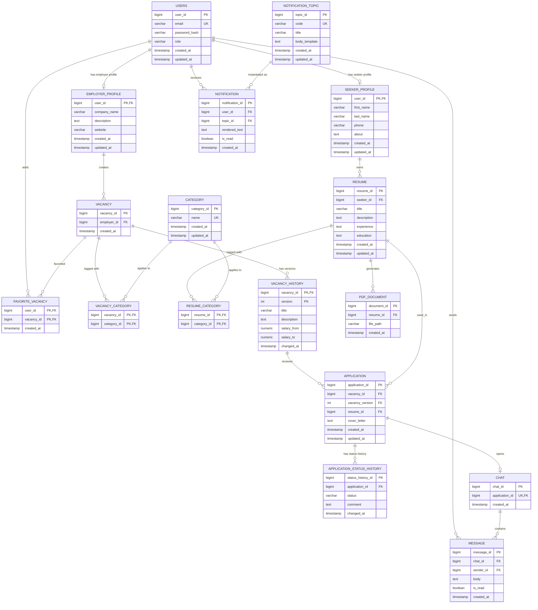

# ER-диаграмма базы данных

> `APPLICATION` хранит конкретную версию вакансии:
> `(vacancy_id, vacancy_version) -> VACANCY_HISTORY(vacancy_id, version)`.

> Для `APPLICATION` также действует ограничение
> `UNIQUE(vacancy_id, resume_id)`.
