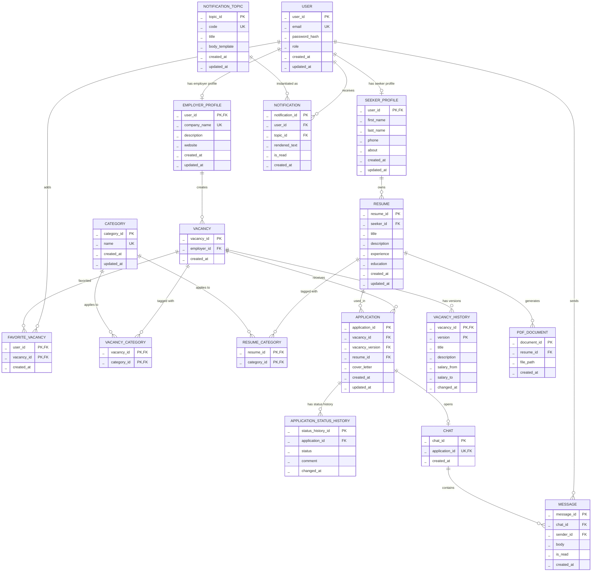

```mermaid
erDiagram
    USER ||--o| EMPLOYER_PROFILE : "has employer profile"
    USER ||--o| SEEKER_PROFILE : "has seeker profile"
    USER ||--o{ NOTIFICATION : receives
    USER ||--o{ FAVORITE_VACANCY : adds
    USER ||--o{ MESSAGE : "sends"

    EMPLOYER_PROFILE ||--o{ VACANCY : creates
    SEEKER_PROFILE ||--o{ RESUME : owns

    VACANCY ||--o{ VACANCY_CATEGORY : "tagged with"
    RESUME ||--o{ RESUME_CATEGORY : "tagged with"

    CATEGORY ||--o{ VACANCY_CATEGORY : "applies to"
    CATEGORY ||--o{ RESUME_CATEGORY : "applies to"

    VACANCY ||--o{ APPLICATION : receives
    VACANCY ||--o{ FAVORITE_VACANCY : favorited
    VACANCY ||--o{ VACANCY_HISTORY : "has versions"

    APPLICATION ||--o{ APPLICATION_STATUS_HISTORY : "has status history"
    APPLICATION ||--o| CHAT : "opens"
    CHAT ||--o{ MESSAGE : "contains"

    RESUME ||--o{ APPLICATION : used_in
    RESUME ||--o{ PDF_DOCUMENT : generates

    NOTIFICATION_TOPIC ||--o{ NOTIFICATION : "instantiated as"

    USER {
        _ user_id PK
        _ email UK
        _ password_hash
        _ role
        _ created_at
        _ updated_at
    }

    EMPLOYER_PROFILE {
        _ user_id PK, FK
        _ company_name UK
        _ description
        _ website
        _ created_at
        _ updated_at
    }

    SEEKER_PROFILE {
        _ user_id PK, FK
        _ first_name
        _ last_name
        _ phone
        _ about
        _ created_at
        _ updated_at
    }

    CATEGORY {
        _ category_id PK
        _ name UK
        _ created_at
        _ updated_at
    }

    VACANCY {
        _ vacancy_id PK
        _ employer_id FK
        _ created_at
    }

    VACANCY_CATEGORY {
        _ vacancy_id PK, FK
        _ category_id PK, FK
    }

    VACANCY_HISTORY {
        _ vacancy_id PK, FK
        _ version PK
        _ title
        _ description
        _ salary_from
        _ salary_to
        _ changed_at
    }

    RESUME {
        _ resume_id PK
        _ seeker_id FK
        _ title
        _ description
        _ experience
        _ education
        _ created_at
        _ updated_at
    }

    RESUME_CATEGORY {
        _ resume_id PK, FK
        _ category_id PK, FK
    }

    APPLICATION {
        _ application_id PK
        _ vacancy_id FK
        _ vacancy_version FK
        _ resume_id FK
        _ cover_letter
        _ created_at
        _ updated_at
    }

    APPLICATION_STATUS_HISTORY {
        _ status_history_id PK
        _ application_id FK
        _ status
        _ comment
        _ changed_at
    }

    FAVORITE_VACANCY {
        _ user_id PK, FK
        _ vacancy_id PK, FK
        _ created_at
    }

    NOTIFICATION_TOPIC {
        _ topic_id PK
        _ code UK
        _ title
        _ body_template
        _ created_at
        _ updated_at
    }

    NOTIFICATION {
        _ notification_id PK
        _ user_id FK
        _ topic_id FK
        _ rendered_text
        _ is_read
        _ created_at
    }

    PDF_DOCUMENT {
        _ document_id PK
        _ resume_id FK
        _ file_path
        _ created_at
    }

    CHAT {
        _ chat_id PK
        _ application_id UK, FK
        _ created_at
    }

    MESSAGE {
        _ message_id PK
        _ chat_id FK
        _ sender_id FK
        _ body
        _ is_read
        _ created_at
    }
```
